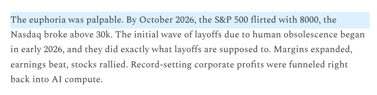
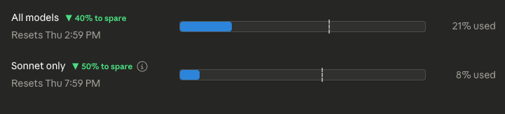
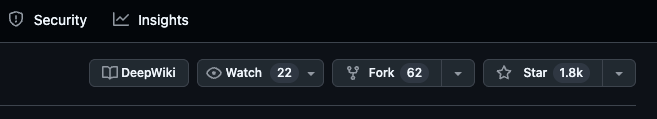

# Browser Ducktape 🦆

A small collection of userscripts to patch up and improve your daily browsing experience.

These scripts run in your browser to fix annoyances, improve focus, or add missing features to sites like GitHub, YouTube, Claude, and more.

## How to Use

1.  **Install a Userscript Manager**:
    I recommend [Violentmonkey](https://violentmonkey.github.io/) (Open Source, lightweight).
    -   [Chrome/Edge/Brave](https://chrome.google.com/webstore/detail/violentmonkey/jinjacmigcnfinphajbemlabodjabnV)
    -   [Firefox](https://addons.mozilla.org/en-US/firefox/addon/violentmonkey/)

2.  **Install a Script**:
    -   Click on any `.js` file in this repository.
    -   Click the **Raw** button.
    -   Violentmonkey will automatically prompt you to install it.

## The Scripts

### 🧠 Focus & Accessibility
-   **`adhd_reader.js`**: Adds a "reading ruler" that highlights the line under your cursor. Great for keeping your place and improving focus on long articles.
    

-   **`worth_watching.js`**: A gentle intervention for YouTube and Bilibili. Blurs the video player and asks "Is this video really worth your time?" to prevent doomscrolling.

### 🤖 AI Tools
-   **`claude_usage_pace.js`**: Visualizes your Claude.ai usage limits. Adds a pace marker to the progress bar so you know if you're burning through messages too fast.
    

-   **`gemini_dynamic_tab_title.js`**: Automatically updates your browser tab title to match the current Gemini conversation, making it easier to find the right tab.

### 🛠️ Utilities
-   **`deepwiki_on_github.js`**: Adds a quick link to DeepWiki on GitHub repository pages, helping you find better documentation faster.
    

-   **`youtube_transcript_downloader.js`**: Adds a simple download button to the YouTube transcript panel. One click to save the full text.

## Contributing
Feel free to open an issue or PR if you have a fix or a new script idea!
