# Browser Ducktape 🦆

Userscripts for patching up daily browsing annoyances.

## Install

**1. Get a userscript manager**

| Browser | Manager |
| --- | --- |
| Chrome, Brave, Edge, Arc | [Tampermonkey](https://chromewebstore.google.com/detail/tampermonkey/dhdgffkkebhmkfjojejmpbldmpobfkfo) |
| Firefox | [Violentmonkey](https://addons.mozilla.org/firefox/addon/violentmonkey/) or [Tampermonkey](https://addons.mozilla.org/firefox/addon/tampermonkey/) |
| Safari | [Userscripts](https://apps.apple.com/app/userscripts/id1463298887) |

> **Chrome/Brave/Edge users:** Chrome 138+ requires one extra step, or scripts silently do nothing. Go to `chrome://extensions`, click **Details** on Tampermonkey, and turn on **Allow user scripts**. ([Why?](https://www.tampermonkey.net/faq.php#Q209))
>
> Violentmonkey's stable release is still Manifest V2, which Chrome is phasing out and Brave refuses to install — use Tampermonkey there.

**2. Click an Install link below.** Your manager will open an install screen. Confirm, and you're done. Scripts auto-update when this repo gets fixes.

**3. AI scripts need an API key** (translate, hover verdict, prompt rewrite). Any OpenAI-compatible endpoint works — DeepSeek, OpenAI, a local model. Right-click the script's floating button, or use the Tampermonkey menu, to open its settings.

## Scripts

### 🧠 Focus & Accessibility

**ADHD Reading Ruler** — [Install](https://raw.githubusercontent.com/wilbeibi/browser-ducktape/main/adhd_reader.user.js) · [Source](adhd_reader.user.js)
Highlights the line you're reading. Keeps your eyes from wandering. Only activates on text-dense article pages — feeds, dashboards, and app UIs are left alone.

**Video Watch Confirmation** — [Install](https://raw.githubusercontent.com/wilbeibi/browser-ducktape/main/worth_watching.user.js) · [Source](worth_watching.user.js)
During work hours, blurs YouTube/Bilibili and asks a purpose-focused question before you can watch. Leaving is the primary action; continuing requires a 10-second pause plus a short written intention.

### 🤖 AI Tools

**Inline Article Translator** — [Install](https://raw.githubusercontent.com/wilbeibi/browser-ducktape/main/inline_translate.user.js) · [Source](inline_translate.user.js)
Bilingual inline translation. Click the floating 译 button (or hit `Ctrl+T`) and every paragraph gets its Chinese translation right below the original. Also does text-selection translation (划词翻译) — select any text for an instant dictionary-style popup. Streaming, lazy loading, and local caching keep it fast.

**Hover Link Verdict** — [Install](https://raw.githubusercontent.com/wilbeibi/browser-ducktape/main/hover_verdict.user.js) · [Source](hover_verdict.user.js)
Preview links before opening them, so you can avoid unnecessary tab switches. Linger for a short summary when the preview is not enough.

**Prompt Enhancer** — [Install](https://raw.githubusercontent.com/wilbeibi/browser-ducktape/main/prompt_rewrite.user.js) · [Source](prompt_rewrite.user.js)
One-click prompt enhancer for Claude, ChatGPT, and Gemini. Hit ✨, get a sharper prompt. Undo if you don't like it.

**Claude Usage Pace Indicator** — [Install](https://raw.githubusercontent.com/wilbeibi/browser-ducktape/main/claude_usage_pace.user.js) · [Source](claude_usage_pace.user.js)
Shows a progress bar of your Claude usage against your reset timer, so you know whether to pace yourself or go all-in.

**Gemini Dynamic Tab Title** — [Install](https://raw.githubusercontent.com/wilbeibi/browser-ducktape/main/gemini_dynamic_tab_title.user.js) · [Source](gemini_dynamic_tab_title.user.js)
Names your Gemini tabs after the conversation so you can actually find them.

### 🛠️ Utilities

**GitHub to DeepWiki Link** — [Install](https://raw.githubusercontent.com/wilbeibi/browser-ducktape/main/deepwiki_on_github.user.js) · [Source](deepwiki_on_github.user.js)
Adds a button on GitHub repos to jump straight to DeepWiki for AI-generated docs and code explanations.

## License

MIT
