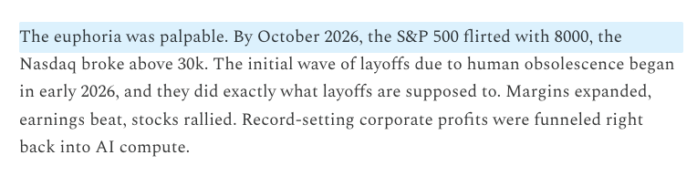
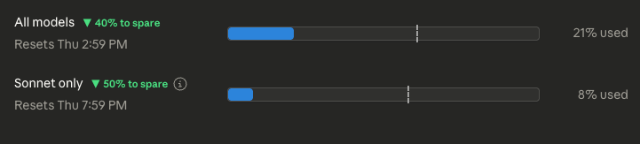
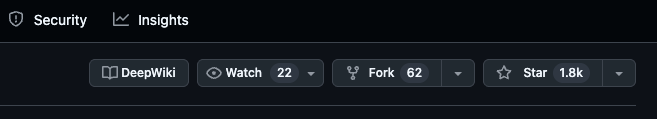

# Browser Ducktape 🦆

Small userscripts for fixing everyday browsing annoyances with Tampermonkey or Violentmonkey.

## Install

Use [Tampermonkey](https://www.tampermonkey.net/) or [Violentmonkey](https://violentmonkey.github.io/), then click an **Install** link below and confirm. Scripts update automatically.

> **Chrome, Brave, Edge, and Arc:** In Tampermonkey's extension details, turn on **Allow user scripts**. ([Why?](https://www.tampermonkey.net/faq.php#Q209))

Some scripts require an OpenAI-compatible API endpoint and key.

## Scripts

### 🧠 Focus & Accessibility

**ADHD Reading Ruler** — [Install](https://raw.githubusercontent.com/wilbeibi/browser-ducktape/main/adhd_reader.user.js) · [Source](adhd_reader.user.js)
Makes long articles easier to follow, one line at a time. Otherwise, it stays out of the way.

**Video Watch Confirmation** — [Install](https://raw.githubusercontent.com/wilbeibi/browser-ducktape/main/worth_watching.user.js) · [Source](worth_watching.user.js)
Adds a small pause before YouTube or Bilibili turns into the rest of your afternoon.

### 🤖 AI Tools

**Inline Article Translator** — [Install](https://raw.githubusercontent.com/wilbeibi/browser-ducktape/main/inline_translate.user.js) · [Source](inline_translate.user.js)
Puts Chinese translations beside the original article, so reading does not become a tour of several browser tabs.

**Hover Link Verdict** — [Install](https://raw.githubusercontent.com/wilbeibi/browser-ducktape/main/hover_verdict.user.js) · [Source](hover_verdict.user.js)
Helps you decide whether a link is worth opening before it becomes another tab you will definitely read later.

**Prompt Enhancer** — [Install](https://raw.githubusercontent.com/wilbeibi/browser-ducktape/main/prompt_rewrite.user.js) · [Source](prompt_rewrite.user.js)
Cleans up rough prompts for Claude, ChatGPT, and Gemini without turning them into a corporate memo.

**Claude Usage Pace Indicator** — [Install](https://raw.githubusercontent.com/wilbeibi/browser-ducktape/main/claude_usage_pace.user.js) · [Source](claude_usage_pace.user.js)
Shows whether your Claude usage is on pace, so the limit does not arrive as a fun little surprise.

**Gemini Dynamic Tab Title** — [Install](https://raw.githubusercontent.com/wilbeibi/browser-ducktape/main/gemini_dynamic_tab_title.user.js) · [Source](gemini_dynamic_tab_title.user.js)
Gives Gemini tabs useful names, which makes finding the right conversation less archaeological.

### 🛠️ Utilities

**Duplicate Tabs Closer** — [Install](https://raw.githubusercontent.com/wilbeibi/browser-ducktape/main/duplicate_tabs_closer.user.js) · [Source](duplicate_tabs_closer.user.js)
Closes duplicate tabs across browser windows. Apparently the same page did not need to be open four times.

**GitHub Tab Title** — [Install](https://raw.githubusercontent.com/wilbeibi/browser-ducktape/main/github_tab_title.user.js) · [Source](github_tab_title.user.js)
Rewrites GitHub tab titles as `#123 Fix login redirect · repo`, so a crowded tab strip still tells you which issue, PR, file, or commit each tab is.

**GitHub to DeepWiki Link** — [Install](https://raw.githubusercontent.com/wilbeibi/browser-ducktape/main/deepwiki_on_github.user.js) · [Source](deepwiki_on_github.user.js)
Gets you from a GitHub repository to its DeepWiki explanation without the usual copy, paste, and minor sigh.

## License

MIT
